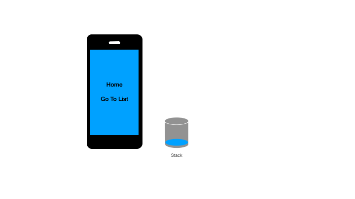

# Stack-Keep-Alive
`Stack-Keep-Alive` 是`Vue.js`(Vue 3.x)项目中页面缓存自动管理工具。

[Vue2.x 版本](https://github.com/Zippowxk/vue-router-keep-alive-helper)



### 为什么需要本插件：
在使用```Vue.js```搭配```vue-router```开发单页面应用时，经常使用[keep-alive](https://v3.cn.vuejs.org/api/built-in-components.html#keep-alive)组件缓存浏览过的页面来提升用户体验，目前提供了如下配置方式来动态管理缓存
```
include - 只有名称匹配的组件会被缓存。
exclude - 任何名称匹配的组件都不会被缓存。
max - 最多可以缓存多少组件实例。
```
但是这只能处理简单状况，无法应对复杂状况，比如：

1. 如何在返回上一页面时，销毁当前页面缓存
2. 如何缓存多个使用相同组件的页面，并且有针对性的销毁

### 功能

1. 自动侦测前进或后退
2. 后退时自动销毁当前页面缓存
3. 前进时自动创建新的缓存实例，不管该组件是否被缓存过
4. 刷新页面后，仍能够准确识别前进或后退
5. `replaceStay`白名单帮助在tab切换时缓存页面

### 使用方式

1. ```npm i -s stack-keep-alive```
2. 使用``stack-keep-alive``替换``keep-alive``组件 (无需引入，已注册全局组件)
```vue
<!-- 注意绑定key -->  
<router-view v-slot="{ Component }">
  <stack-keep-alive v-slot='{ key }'> 
      <component :is="Component" :key='key'/>
  </stack-keep-alive>
</router-view>
```
3. 在app初始化时，使用StackKeepAlive插件
```javascript
import StackKeepAlive from 'stack-keep-alive'
const app = Vue.createApp({})
app.use(StackKeepAlive)
...
```

### 配置

1. replace白名单
  
  在tab栏切换时，需要留存某些tab页面，可以在replaceStay中配置这些路径
```vue
<stack-keep-alive v-slot='{ key }' :replaceStay='["/foo"]'> 
    <component :is="Component" :key='key'/>
</stack-keep-alive>
```

### 更新日志
#### v1.0.0-beta.0
1. 支持Vue3
2. 单元测试

### Sample code

1. [静态文件引入](./examples/)

欢迎添加微信 **OmniBug **探讨交流，Email: zippowangxinkai@gmail.com

<!-- ALL-CONTRIBUTORS-LIST:START - Do not remove or modify this section -->
<!-- prettier-ignore-start -->
<!-- markdownlint-disable -->
<!-- markdownlint-restore -->
<!-- prettier-ignore-end -->

<!-- ALL-CONTRIBUTORS-LIST:END -->